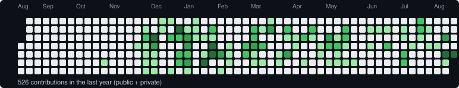

# Hi, I'm Omar 👋

**Full-stack engineer who ships production systems solo** — currently building aid-delivery
infrastructure for NGOs in Malaysia.

 

## 🚀 What I'm building

**ImpactNow** — a multi-tenant aid management platform connecting donors, project managers,
and suppliers to track aid delivery to beneficiaries, in production and serving real
organizations.

Designed and built solo, end to end:
- Multi-tenant data model with per-organization access scoping across three distinct user roles
- A fulfillment state machine covering the full donation → task → delivery → audit lifecycle
- Role-based dashboards for admins, project managers, and suppliers

**Stack**

 

## 💼 About

Based in Malaysia 🇲🇾, currently at **UNITI WAQI SDN BHD**. I work across the full stack —
data modeling, backend APIs, frontend, and deployment — and I'm the sole engineer on ImpactNow
from architecture through to running it in production.

 

## 📊 Contributions

Public + private, last 12 months. Static snapshot — updated manually from time to time,
not live.

 

